# Routely | راوتلي
### Cairo Multimodal Transit Navigation


---

## What is Routely?

Cairo is one of the most transit-dense cities in the world — and one of the worst documented. The metro, the public bus network, and the vast informal microbus system each operate in isolation, with no unified navigation layer connecting them.

There is no app that tells you: *"Take the 948 bus to Ramses, walk 3 minutes, then take Line 1 six stops to your destination."*

Routely is being built to fix that.

---

## Features

| Feature | Details |
|---------|---------|
| **Trip Planner** | Fastest / Cheapest / Fewest Transfers — three distinct routing modes |
| **Metro Navigator** | All 84 stations across 3 lines with zone-based fare calculation |
| **Routes Browser** | 672 bus and microbus routes searchable by number or destination |
| **Microbus Stations** | 27 مواقف hubs with full destination lists |
| **Bilingual** | Full Arabic/English interface |
| **Offline-first** | Core functionality works without a network connection |

---

## Screenshots

| Splash | Metro Navigator | Metro Result |
|--------|----------------|--------------|
| 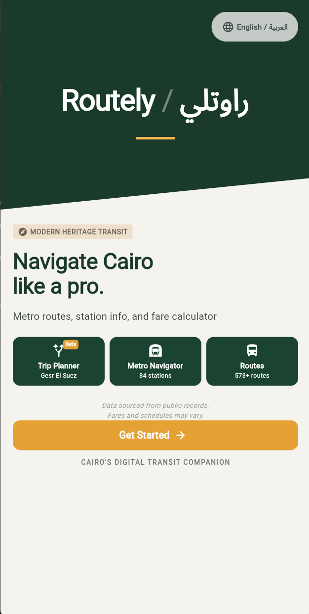 | 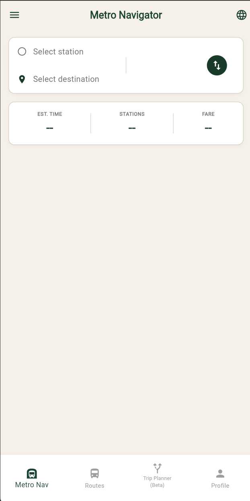 | 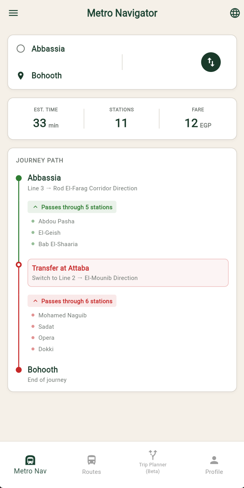 |

| Buses List | Two-Stop Search | Route Number Search |
|------------|----------------|---------------------|
| 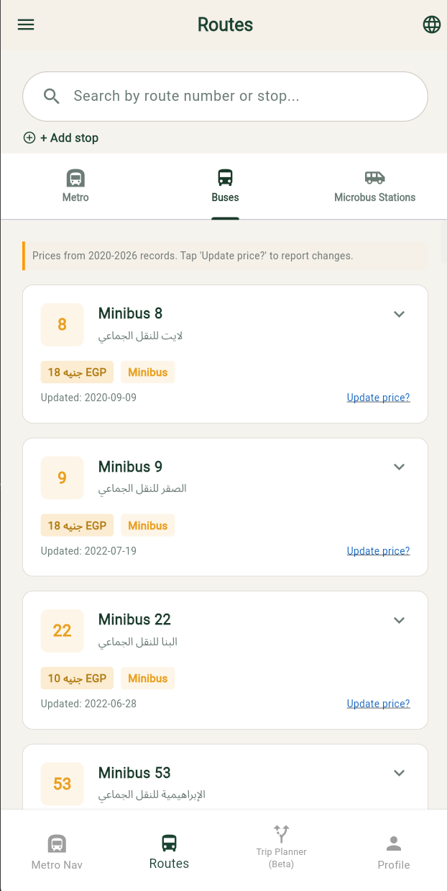 | 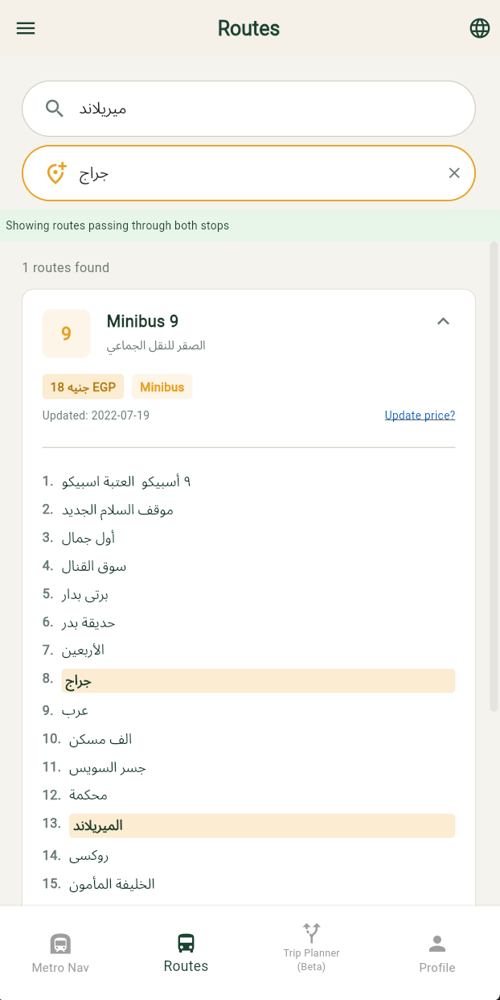 | 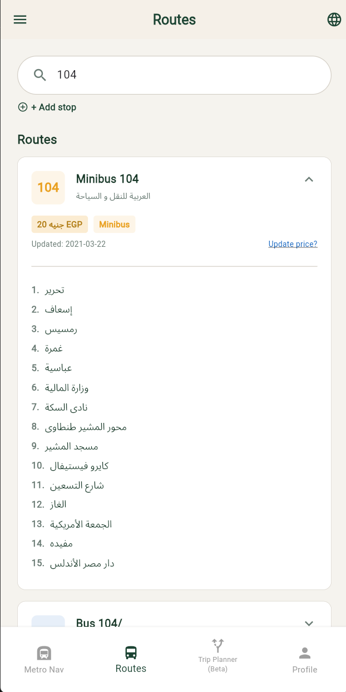 |

| Metro Tab | Microbus Stations | Trip Planner Results |
|-----------|------------------|----------------------|
| 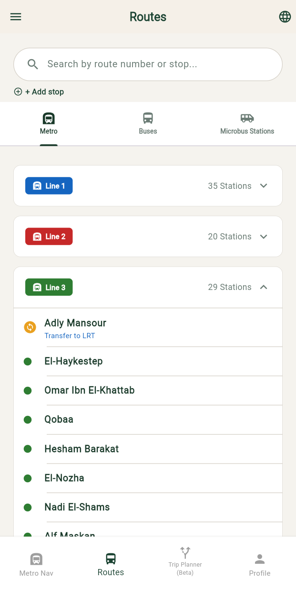 | 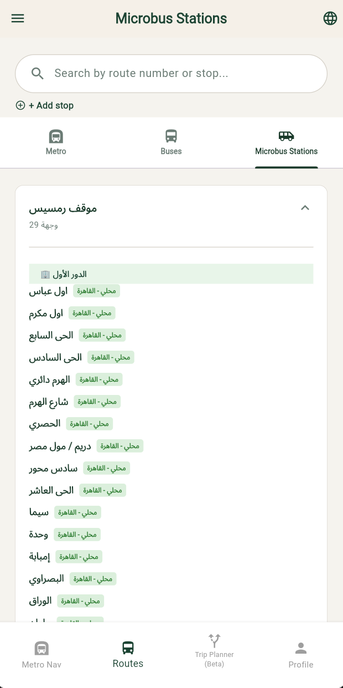 | 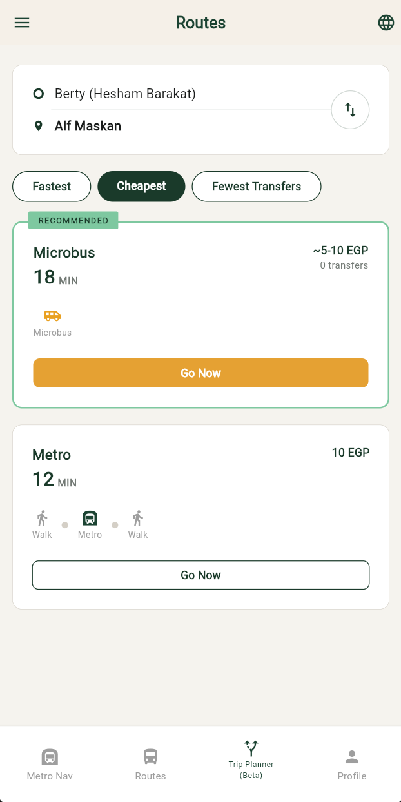 |

| Route Detail Map | Save Route | Saved Routes |
|-----------------|------------|--------------|
| 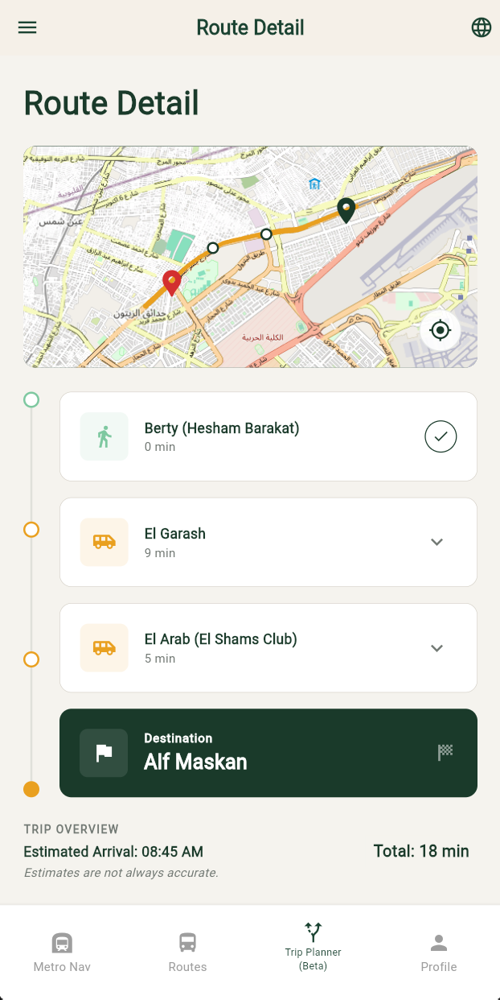 | 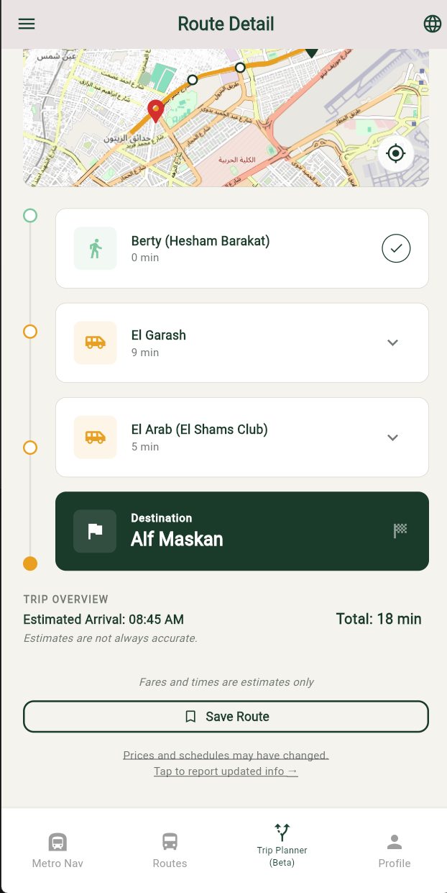 | 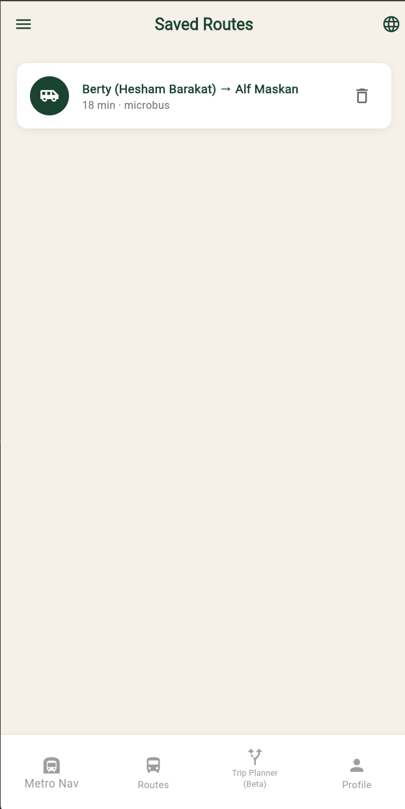 |

---

## Tech Stack

| Layer | Technology |
|-------|-----------|
| Frontend | Flutter / Dart |
| Database | Firebase Firestore (remote config + version-gated delivery) |
| Offline cache | SharedPreferences + bundled JSON asset |
| Routing engine | Custom Dijkstra implementation |
| Data format | Master transit dataset — 7.7 MB, 17,274 graph edges across 4 transport modes |

---

## Architecture

### Multimodal Graph

The routing engine models the Cairo transit network as a weighted directed graph:

- **Nodes:** Every bus stop, metro station, and microbus hub
- **Ride edges:** Stop-to-stop along a route (cost = travel time)
- **Transfer edges:** Walk links between nearby nodes of different networks (threshold: 800 m)
- **Walk edges:** User GPS → nearest node, destination node → final GPS

### Dijkstra with Three Cost Functions

Three separate cost functions produce the three result modes:

| Mode | Cost Function |
|------|--------------|
| Fastest | `duration_min + transfer_penalty (3 min/change)` |
| Cheapest | `fare_egp` (minimizes total fare) |
| Fewest Transfers | `vehicle_count` (minimizes number of vehicles) |

### Remote Data Delivery

Transit data is served via Firestore with version-based update gating:

```
app_config/data_manifest → { data_version, last_updated }
transit_data/v1_0_0/sections/{key} → one document per top-level JSON key
```

On launch, the app compares the manifest version against the locally cached version. If a newer version exists, it fetches updated sections selectively. The bundled JSON asset serves as the cold-start fallback when no cache and no network are available.

---

## Data Pipeline

Raw source data (CTA PDFs + scraped web sources) goes through a 3-step normalization pipeline before entering the routing graph. See [`docs/data-pipeline.md`](docs/data-pipeline.md) for full details.

---

## Status & Waitlist

> **In Development — waitlist open with +2000 response**

[Join the waitlist →](https://forms.gle/1vphnqdxnxRtGGxH7)

---

## B.Sc. Graduation Project

Routely was submitted as a B.Sc. Computer Science graduation project at Arab Open University — Egypt and received **Grade A**.

---

## Source & Contact

Source code is private. Contact for collaboration:
📧 eliaj320h@gmail.com
